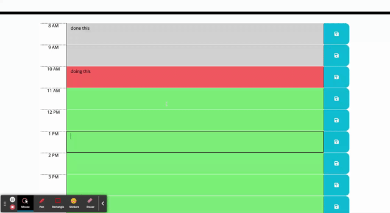
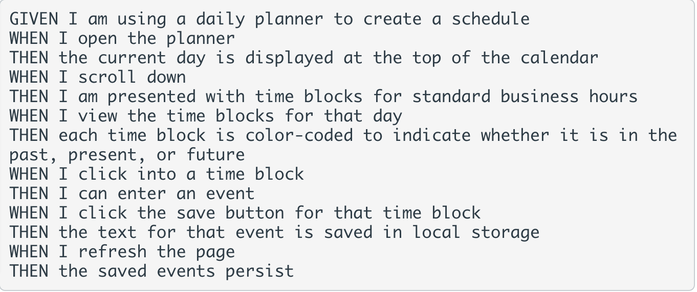

# Work Day Scheduler Starter Code

This is the submission README for Module 5 Workday Scheduler

Here is what the site will look when loaded to browser

I was tasked with refactoring code in order. In order to display day and times, I utilized moment.js.

## User Story

## Acceptance Criteria

:link: [here](Workday-Scheduler)

